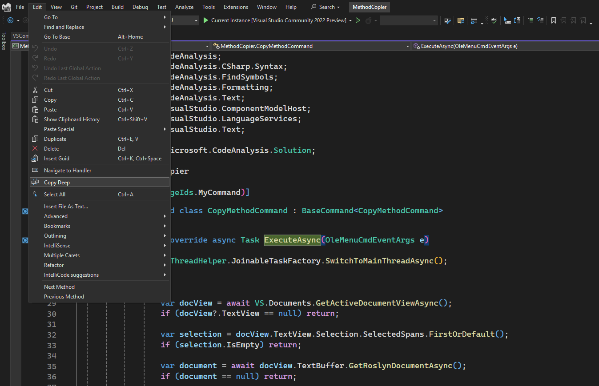

# 📦 Copy Deep – Visual Studio Extension

**Copy Deep** is a Visual Studio extension that helps you extract a method along with all its dependencies — including private submethods, fields, and required types — into a self-contained class.

> ⚙️ Ideal for **legacy code migration**, **modularization**, and **refactoring**.

---

## ✨ Features

- ✅ Copy any method from your code
- ✅ Automatically includes:
  - Private submethods
  - Referenced fields
  - Required nested types
- ✅ Generates a clean, standalone class with preserved behavior
- ✅ Integrates into the **Edit > Copy** menu as **"Copy Deep"**

---

## 📸 Screenshot

---

## 🧩 How It Works

1. Select the method in the code editor
2. Select **Edit > Copy Deep**
3. The selected method and all its dependencies will be copied to the clipboard

---

## 🛠 Use Cases

- 🔄 Migrating legacy logic to new modules
- 🧪 Isolating code for testing
- ♻️ Reusing functionality in different contexts
- 🧹 Refactoring tightly-coupled classes

---

## 📥 Installation

1. Download from the [Visual Studio Marketplace](https://marketplace.visualstudio.com/items?itemName=methodcopier)
2. Install the `.vsix` file or search for **MethodCopier** in **Extensions > Manage Extensions**

---

## 🙋‍♂️ About the Author

Independent developer. Passionate about clean architecture, modular code, and enhancing the developer experience.

---

## 📄 License

MIT License — free to use, modify, and distribute.

---

## 💡 Feedback & Contributions

Issues, ideas, or feature requests?  
Feel free to [open an issue](https://github.com/fediaza/MethodCopier/issues) or submit a PR!

